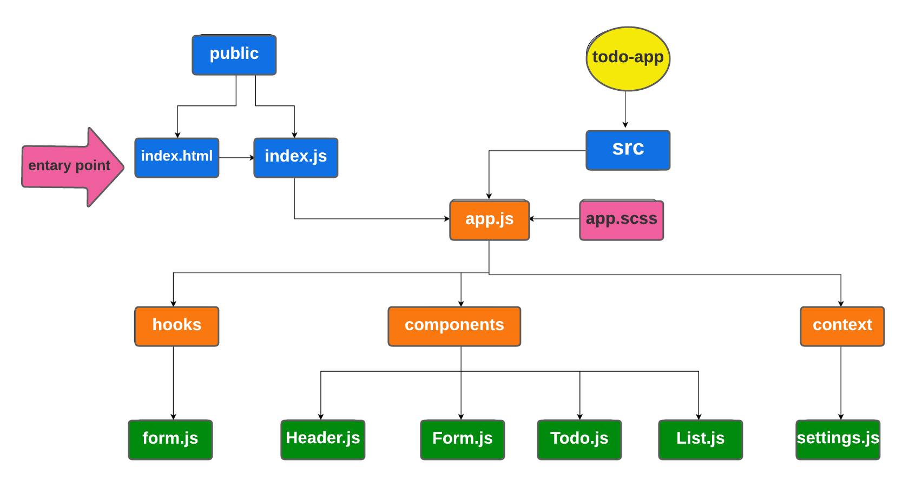

# TO-DO-app

## Author : Dunia Alkilany 

## LAB 31 - Context API

## Description :

* ### one way of using global states in React by using context API. that done by creating, providing, wrapping, and consumming the context.

* ### useForm is a custom hook that contains a function that will be called when you click on the submit button, and will handle onSumbit and onchange functions.

##  TO-DO App Phase 1:

### In Phase 1, we’re going to perform some refactoring of the To Do application as built by another team. This application mixes application state and user settings at the top level and passes things around. It was a good proof of concept, but we need to make this production ready.

1. adding a global state by context-API
2. adding a pagination.
3. adding style from BluePrint UI.

## Links and Resources:

* ### [code sand box /Phase 1](https://s8rl2.csb.app/)

* ### [lab 31 pull request ](https://github.com/Duniaalkilany/todo-app/pull/1)

## UML : 

## result /lab 31 :

## LAB 32 - Context API - Behaviors

##  TO-DO App Phase 2:

### Description : this phase was refactoring and editing on TO DO App by :

1. converting all class components to functional ones.
2. adding settings to edit and control the context.
3. save the selection to local storage.
4. using React Browser Route

## Links and Resources:

* ### [code sand box /Phase 2](https://qmln4.csb.app/)

* ### [lab 32 pull request ](https://github.com/Duniaalkilany/todo-app/pull/3)

## UML : 

## result /lab 32 :

## LAB 33 - Login and Auth /LAB 34 - API Integration

## Authors:
* ### Dunia Alkilany
* ### Munther AbdlRahman
* ### Qusai Qeisi
* ### Nedal Alashqar
* ### Saif Almomani

###  TO-DO App Phase 3-4:

### Phase 3: Adding security and access controls to the application.
### Phase 4: Integrating with a live API.

### Description : this phase was refactoring and editing on TO DO App by :

1. adding sign in and sign up connected to real API.
2. add basic and bearer auth.
3. feature customization based on user role and capability.
4. connect all CRUD operations to real API.
5. activate the delete feature for the admin only.

#### getting started :

* #### sign up and choose a role
* #### log in

* #### components will be rendered based on the role as the following:

   * #### admin : read , create , update , delete .
   * #### editor : read , create , update .
   * #### creater : read , create .
   * #### user : read .

## Links and Resources:

* ### [code sand box /Phase 3-4](https://qmln4.csb.app/)

* ### [lab 33 pull request ](https://github.com/Duniaalkilany/todo-app/pull/4)

* ### [lab 34 pull request ](https://github.com/Duniaalkilany/todo-app/pull/5)

## UML : 

## result /lab 33-34 :

## server/backend

* ### [Heroku](https://dunia-todo.herokuapp.com/)

* ### [ToDo-backend ](https://github.com/Duniaalkilany/ToDo-backend)

 

